# 🤖 Agentic AI System Architecture & Workflow

## 🏗️ **System Architecture Overview**

```mermaid
graph TB
    %% User Interface Layer
    UI[🎨 Streamlit UI<br/>Multi-tab Dashboard]
    
    %% Document Input Layer
    DOCS[📄 Document Upload<br/>Invoices, Contracts, MSAs, Leases, Fixed Assets]
    
    %% Message Queue Layer
    MQ[📬 Message Queue<br/>Central Communication Hub]
    
    %% Agent Layer
    EA[🔍 Extraction Agent<br/>Data Extraction & OCR]
    CA[📋 Contract Agent<br/>Contract Validation]
    MA[📜 MSA Agent<br/>Master Service Agreement]
    LA[📝 Leasing Agent<br/>Lease Management]
    FA[🏢 Fixed Assets Agent<br/>Asset Tracking]
    MDA[🗃️ Master Data Agent<br/>Data Validation]
    QRA[✅ Quality Review Agent<br/>Anomaly Detection]
    LA2[🧠 Learning Agent<br/>Feedback Processing]
    MGA[👨‍💼 Manager Agent<br/>Orchestration & State Management]
    
    %% Data Layer
    DB[(💾 Data Storage<br/>JSON Files, In-Memory State)]
    
    %% External Systems
    AI[🤖 AI Services<br/>OpenAI, Anthropic]
    
    %% User Feedback
    USER[👤 Human-in-the-Loop<br/>Feedback & Review]
    
    %% Connections
    UI --> DOCS
    DOCS --> MQ
    MQ --> EA
    MQ --> CA
    MQ --> MA
    MQ --> LA
    MQ --> FA
    MQ --> MDA
    MQ --> QRA
    MQ --> LA2
    MQ --> MGA
    
    EA --> MQ
    CA --> MQ
    MA --> MQ
    LA --> MQ
    FA --> MQ
    MDA --> MQ
    QRA --> MQ
    LA2 --> MQ
    MGA --> MQ
    
    MGA --> DB
    MGA --> AI
    QRA --> USER
    USER --> LA2
    LA2 --> MGA
    
    %% Styling
    classDef uiClass fill:#e1f5fe,stroke:#01579b,stroke-width:2px
    classDef agentClass fill:#f3e5f5,stroke:#4a148c,stroke-width:2px
    classDef mqClass fill:#fff3e0,stroke:#e65100,stroke-width:2px
    classDef dataClass fill:#e8f5e8,stroke:#1b5e20,stroke-width:2px
    
    class UI,DOCS uiClass
    class EA,CA,MA,LA,FA,MDA,QRA,LA2,MGA agentClass
    class MQ mqClass
    class DB,AI dataClass
```

## 🔄 **Detailed Workflow Architecture**

```mermaid
sequenceDiagram
    participant U as 👤 User
    participant UI as 🎨 Streamlit UI
    participant MQ as 📬 Message Queue
    participant MGA as 👨‍💼 Manager Agent
    participant EA as 🔍 Extraction Agent
    participant CA as 📋 Contract Agent
    participant MA as 📜 MSA Agent
    participant QRA as ✅ Quality Review Agent
    participant LA2 as 🧠 Learning Agent
    participant DB as 💾 State Store
    
    U->>UI: Upload Document
    UI->>MQ: Document Upload Event
    MQ->>MGA: Notify Manager Agent
    
    MGA->>DB: Update Workflow State
    MGA->>MQ: Assign to Extraction Agent
    
    MQ->>EA: Process Document
    EA->>MQ: Extraction Results + Confidence Score
    
    MGA->>MQ: Route to Validation Agents
    MQ->>CA: Validate Contract
    MQ->>MA: Validate MSA
    
    CA->>MQ: Contract Validation Results
    MA->>MQ: MSA Validation Results
    
    MGA->>MQ: Send to Quality Review
    MQ->>QRA: Comprehensive Review
    
    QRA->>MQ: Quality Score + Anomalies
    MGA->>DB: Update Final State
    
    alt Anomalies Detected
        MGA->>MQ: Escalate to Human Review
        MQ->>UI: Show Review Interface
        U->>UI: Provide Feedback
        UI->>MQ: Feedback Event
        MQ->>LA2: Process Learning
        LA2->>MGA: Update Agent Knowledge
        MGA->>DB: Update System State
    else No Anomalies
        MGA->>MQ: Approve Document
        MGA->>DB: Mark as Completed
    end
    
    MGA->>UI: Update Dashboard Status
```

## 🎯 **State Management Architecture**

## 🔧 **Core Components & Responsibilities**

### **1. Manager Agent (State Orchestrator)**
- **State Management**: Maintains workflow state across all agents
- **Task Assignment**: Routes documents to appropriate agents
- **Decision Making**: Final approval/rejection based on agent results
- **Escalation**: Routes anomalies to human review
- **Performance Monitoring**: Tracks agent performance and system health

### **2. Message Queue (Communication Hub)**
- **Inter-Agent Communication**: Asynchronous message passing
- **Event Broadcasting**: Notifies relevant agents of state changes
- **Load Balancing**: Distributes work across available agents
- **Retry Logic**: Handles failed operations with exponential backoff
- **Message Persistence**: Stores message history for audit trails

### **3. Agent Collaboration Patterns**
- **Sequential Processing**: Documents flow through validation chain
- **Parallel Validation**: Multiple agents validate simultaneously
- **Cross-Reference Validation**: Agents share data for comprehensive checks
- **Feedback Loop**: Learning Agent improves all agents based on outcomes
- **State Synchronization**: All agents maintain consistent state view

### **4. State Management Strategy**
- **Centralized State**: Manager Agent maintains single source of truth
- **Event-Driven Updates**: State changes trigger agent notifications
- **Immutable State History**: All state changes are logged and versioned
- **Rollback Capability**: System can revert to previous states if needed
- **Real-time Synchronization**: UI updates reflect current state immediately

## 📊 **Performance & Scalability**

### **Throughput Optimization**
- **Batch Processing**: Multiple documents processed simultaneously
- **Agent Pooling**: Multiple instances of each agent type
- **Async Processing**: Non-blocking operations for better responsiveness
- **Caching**: Frequently accessed data cached in memory
- **Load Distribution**: Work distributed based on agent availability

### **Fault Tolerance**
- **Agent Failover**: Failed agents automatically replaced
- **Message Persistence**: No messages lost during system failures
- **State Recovery**: System can recover from any failure point
- **Health Monitoring**: Continuous monitoring of all system components
- **Graceful Degradation**: System continues operating with reduced capacity

This architecture ensures a robust, scalable, and maintainable system where agents collaborate seamlessly while maintaining clear separation of concerns and robust state management.
